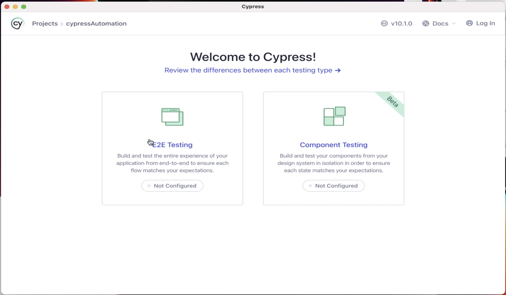
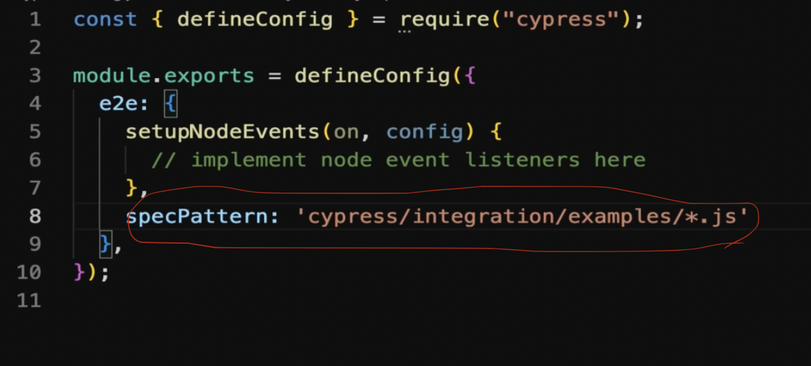

## Section 3: Introduction to Cypress Test Runner and command line features

#### Open Cypress:
1- Terminal: node_modules/.bin/cypress open `This command is used to test a website via a browser`

We can also test a website without using a browser (in VS) by using this command in the terminal: `node_modules/.bin/cypress run ` 

It will automatically test the website in Electron browser but without oppening the brwoser!

#### Second way is faster than the first one!

You can also set what browser will be used for testing by this command: `node_modules/.bin/cypress run  --browser chrome`

2- Below page will be opened automatically:

3- Click on E2E Testing

4- Click on Continue button

5- Choose Chrome browser and click on button

6- Go back to Visual Studio

7- Some folders and files will be added to Visual Studio automatically

8- Create a folder in below route and name it "integration": CypressAutomation/cypress/

9- Create another folder under integration folder and name it: "examples"

10- Create a file in examples folder and name it: "Test01.js"

11- Now you can write your Cypress code inside this file

12- Go to cypress.config.js file and add below code 

13- Save and you will have this Test01 file in spec page and you can execute your cypress test there in live