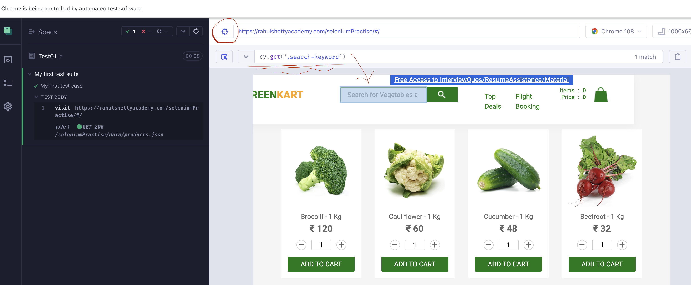

## Section 4: Getting started with Cypress Test Automation

#### How to open a website:

describe("My first test suite", function()
{
    it("My first test case", function()
    {
        cy.visit("http://ehsanabtahiux.com")
    }
    )
}
)

#### To select an object in a website like textbox or button you have to use CSS selectors!

For example: `form input` will select input as a child of form tag.

exm02: `input.search-keyword` will select input as a tag and search-keyword as a class name

exm03: `input[type='search']` will select input tag with type=search

#### You can also use chropath add-on to select an object on a website and see its CSS selector code! 

## I couldn't do that!!!

### You can also select an object on a website in cypress and it automatically show its cypress selector code.

### You have to type this piece of code in the begining of your cypress code to turn the Autocomplete on `/// <reference types="Cypress" />`

#### You can select an object and type something in that automatically by using below code:

`cy.get(".search-keyword").type("Cuc")`